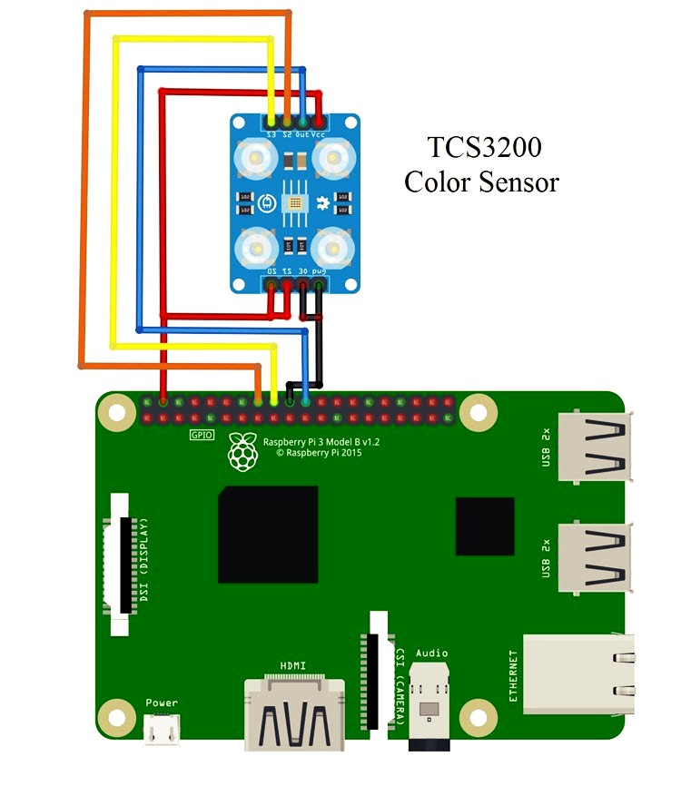

# Raspberry Pi Publishing Node

We have interfaced a color sensor TCS3200 with Raspberry Pi 3B+ and have published the raw sensor values and the color being detected to AWS IoT cloud. The code that performs these tasks is giving in file "source.py". Followinf are the details explaning the use of this code.

## Libraries Required
There are two libraries used in this code which are specific to Raspberry Pi GPIO pins. You have to install them before using this code. 

### RPi.GPIO Library
Type the following command to install RPI.GPIO
```sh

pip install RPI.GPIO

```
### gpiozero Library
Type the following command to install RPI.GPIO
```sh

pip install gpiozero

```
## Circuit Diagram

